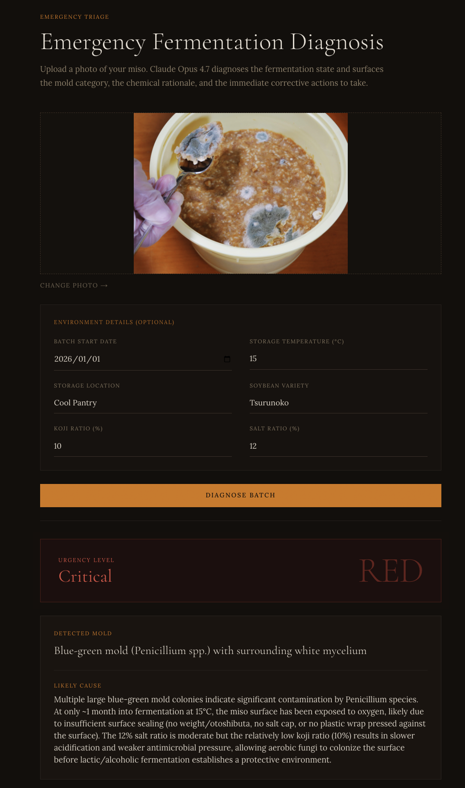
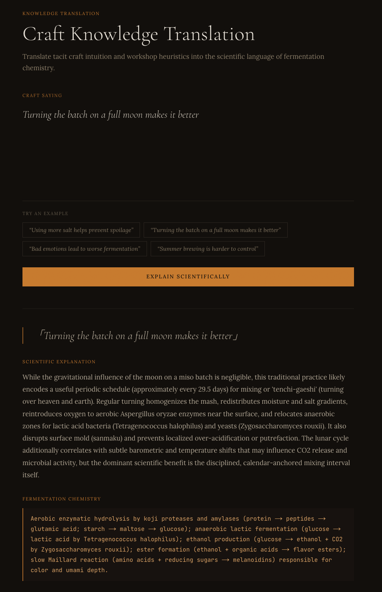
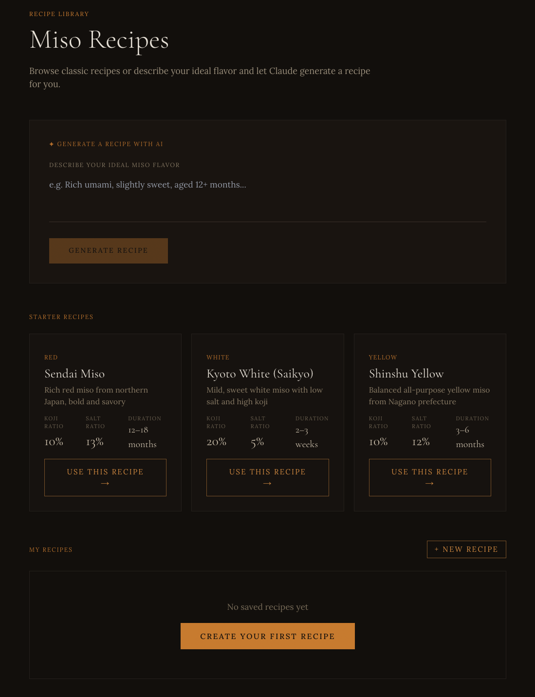
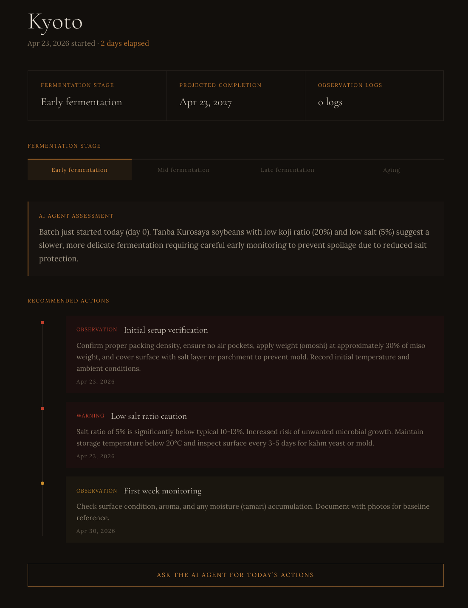

# Misologist - 発酵診断・職人知識継承エンジン

**最終更新:** 2026-04-26

> 「味噌職人の20年の経験を、Opus 4.7 が科学として語る」

**Anthropic Hackathon 2026 - Built with Opus 4.7**

## 概要

Misologist は、家庭味噌仕込み愛好家・小規模味噌蔵・発酵研究者向けの AI 支援アプリです。発酵写真からの緊急診断、職人知識の発酵化学への翻訳、味噌バッチとレシピの記録管理を行います。

## プロダクト画面

### 診断



審査員が中核となるAI体験を確認できる画面です。発酵写真とバッチメタデータを組み合わせ、Claude Opus 4.7 が緊急度、カビ種別、発酵化学的根拠、対応手順を返します。

### 知識翻訳



職人の経験則や伝承知識を、実践に使える発酵化学の説明へ変換するAIワークフローです。

### レシピ



スターターレシピ、保存済みレシピ、目標の味からの逆引き設計を確認できます。生成したレシピ案は保存し、バッチ作成時に再利用できます。

### バッチ



長期的なプロダクト方向性を示す画面です。保存済みバッチ、発酵経過日数、レシピ文脈、オンデマンドAI監視への導線を確認できます。

## 現在の機能

### 緊急発酵診断

発酵写真をアップロードすると、Claude Opus 4.7 が構造化された診断結果を返します。

- **カビ種別判定:** 産膜酵母らしき白い膜、青カビ、赤色酵母などを判別します。
- **緊急度レベル:** `GREEN` / `YELLOW` / `RED`。
- **発酵化学的根拠:** なぜ問題がある、または問題が小さいと考えられるかを説明します。
- **具体的アクション:** 除去手順、観察ポイント、再発防止策を提示します。
- **メタデータ反映:** 開始日、温度、保存場所、大豆品種、麹歩合、塩分比を任意でプロンプトに反映します。

写真は現在、base64 画像データとして診断 API に送信されます。Supabase Storage の bucket はスキーマ上で定義されていますが、アップロード写真を Storage に永続保存するフローはまだ接続されていません。

### バッチ監視

バッチを作成し、詳細ページで状態を確認し、AI によるバッチ評価をオンデマンドで生成できます。

- バッチ情報は Supabase に保存されます。
- バッチ評価はアプリの API から都度生成されます。
- 最新の評価結果は `agent_sessions` に保存されます。
- モデル応答に含まれる場合、次回確認日時を `next_action_at` に保存します。

現状は Claude Managed Agents による長期常駐タスクや定期実行ワーカーではありません。`app/api/agent-sessions/route.ts` に実装されたオンデマンド API フローです。

### 職人知識翻訳

味噌作りの経験則や伝承知識を入力すると、Claude Opus 4.7 が発酵化学の観点から説明します。

### レシピ管理と逆引き設計

スターターレシピの閲覧、カスタムレシピの保存、目標の味からのレシピ生成ができます。

- スターターレシピは Supabase スキーマでseedされます。
- 保存したレシピは `recipes` テーブルに保存されます。
- AI が生成したレシピ案はアプリ上から保存できます。

## プロダクト方針

最初のアイデアは単発写真診断ツールでしたが、以下の方向へ設計を調整しています。

| 修正前の問題 | 根拠 | 現在の方向性 |
|---|---|---|
| 単発写真診断のみ | Vision診断だけでは Opus 4.7 の必然性が弱い | バッチメタデータと将来的な縦断ログを組み合わせた診断 |
| 発酵スコア0-100 | 計算根拠が曖昧 | 発酵化学に基づく説明生成 |
| 短時間の同期エージェント処理 | 長期非同期エージェントの強みを活かしにくい | バッチ記録とオンデマンド評価を実装し、将来の定期監視に拡張可能な形にする |

## 技術スタック

| レイヤー | コンポーネント | 役割 |
|---|---|---|
| フロントエンド | Next.js 14 App Router | 診断UI、知識翻訳、レシピ、バッチダッシュボード |
| AI エンジン | Claude Opus 4.7 via Anthropic SDK | Vision診断、発酵推論、知識翻訳、レシピ生成 |
| API 実行環境 | Next.js Route Handlers | `app/api/**` のアプリAPI |
| データ | Supabase Postgres | バッチ、レシピ、エージェント状態、スキーマ定義済みログ |
| ストレージ | Supabase Storage | `miso-photos` bucket は定義済み。アップロードフローは未接続 |
| デプロイ | Vercel | フルスタック Next.js 実行環境 |

## セットアップ

### 前提条件

- Node.js 18+
- Opus 4.7 にアクセスできる Anthropic API キー
- バッチ・レシピ保存機能を使う場合は Supabase プロジェクト

### 環境変数

`.env.local` を作成します。

診断、知識翻訳、レシピ生成など AI のみのフロー:

```env
ANTHROPIC_API_KEY=your_anthropic_api_key
```

バッチとレシピの保存機能:

```env
NEXT_PUBLIC_SUPABASE_URL=your_supabase_url
NEXT_PUBLIC_SUPABASE_ANON_KEY=your_supabase_anon_key
```

`SUPABASE_SERVICE_ROLE_KEY` は現在のアプリケーションコードでは使用していません。

### Supabase スキーマ初期化

Hosted Supabase を使う場合は、Supabase SQL Editor で `docs/schema.sql` を実行するか、`supabase/migrations/` 配下のマイグレーションを利用してください。

スキーマは以下を作成します。

- `batches`
- `logs`
- `agent_sessions`
- `recipes`
- `miso-photos` Storage bucket

現在のRLSポリシーは開発向けの `allow_all_*` です。本番公開前に認証・権限設計に合わせて置き換えてください。

### インストール・起動

```bash
npm install
npm run dev
```

`http://localhost:3000` で起動します。

## データスキーマ

```sql
batches:        id / name / started_at / recipe_json / status / created_at
logs:           id / batch_id / captured_at / photo_url / env_json / diagnosis_json / action_json / created_at
agent_sessions: id / batch_id / agent_state / last_action_at / next_action_at / created_at
recipes:        id / name / description / miso_type / koji_ratio / salt_ratio / soybean_variety / water_content / fermentation_duration / notes / is_template / created_at
```

## よく使うコマンド

```bash
npm run dev
npm run build
npm run lint
npm test -- --runInBand
npm run test:e2e
```

## ライセンス

MIT License - see [LICENSE](LICENSE)
